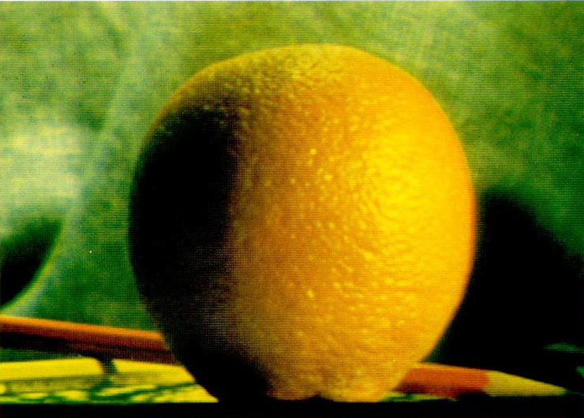
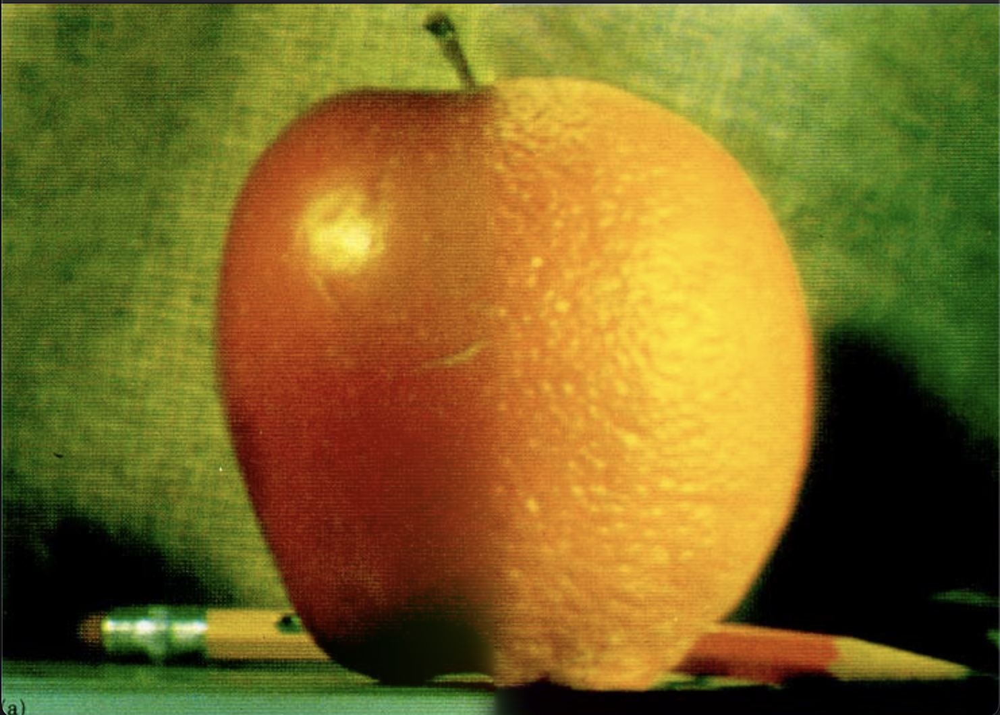

# Computer-Vision
아주대학교 컴퓨터 비전 수업

## Mutiband blending 과제 (09/20)
 - 사과와 오렌지 이미지를 mask 이미지에 맞게 구분선 없이 절반 절반(흰/검)으로 자연스럽게 blending 하기

   + 시나리오
     1. 이미지를 불러온다.
     2. 각 이미지를 단계를 설정하여 가우시안 피라미드를 구한다.
     3. 가우시안 피라미드를 사용하여 라플라시안 피라미드 생성
     4. 오렌지와 사과 라플라시안을 주어진 mask에 맞추어 합성
     5. 라플라시안 합성본들을 다시 합성시킨다.
   + 주어진 이미지 
     * mask image (흰/검)  
      
     * apple image
      
     * orange image
      
 - 결과물
   

  
