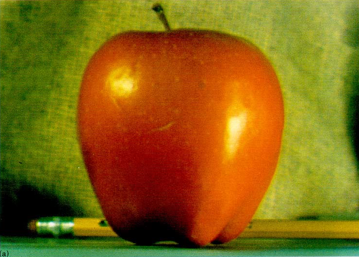
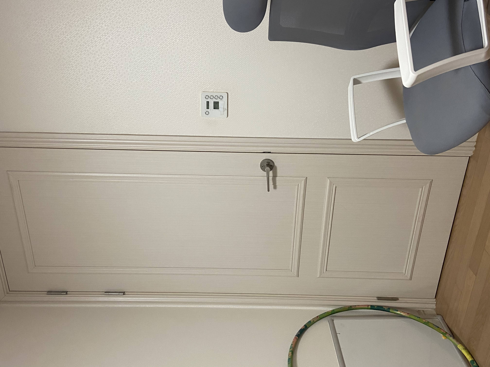
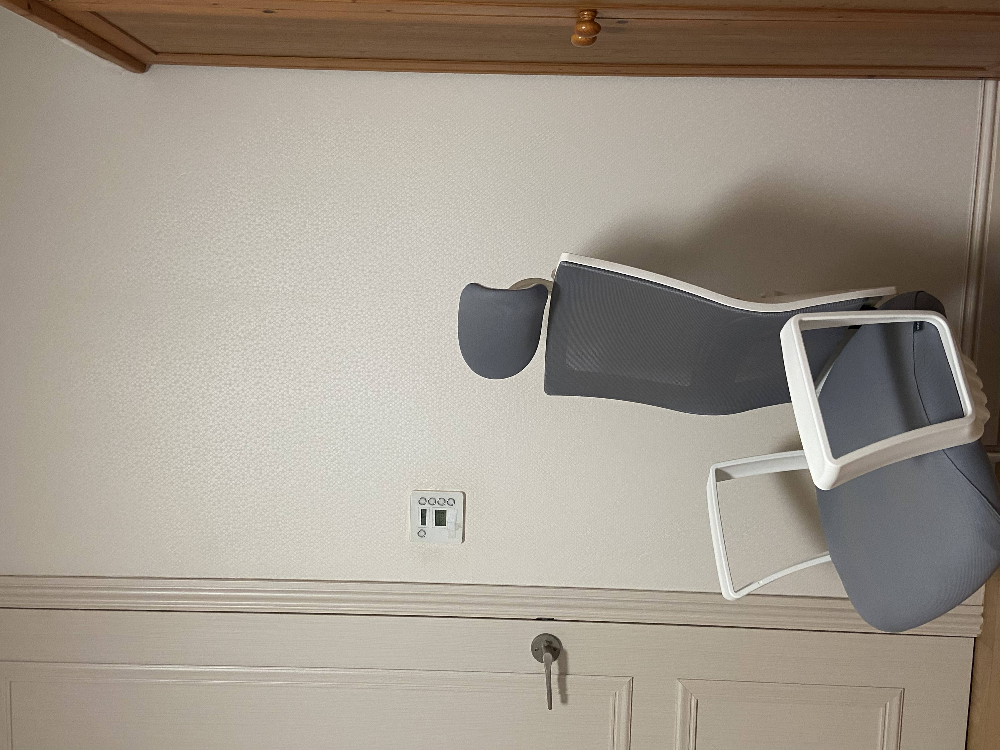
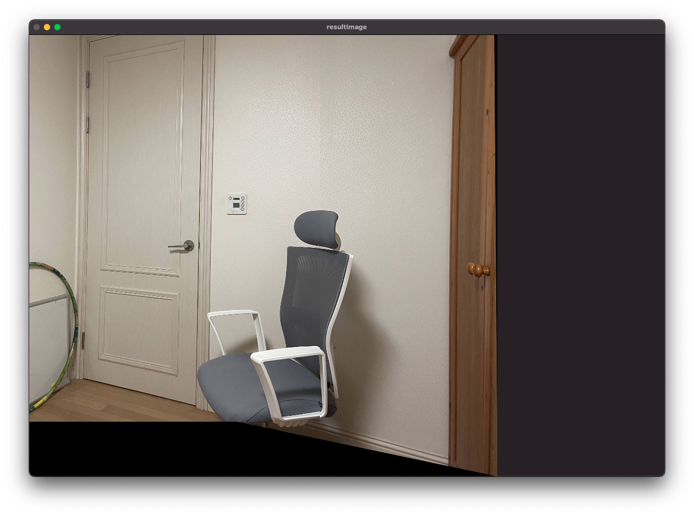

# Computer-Vision
아주대학교 컴퓨터 비전 수업

## Multiband blending 과제 (09/20)
 - 사과와 오렌지 이미지를 mask 이미지에 맞게 구분선 없이 절반 절반(흰/검)으로 자연스럽게 blending 하기

   + 시나리오
     1. 이미지를 불러온다.
     2. 각 이미지를 단계를 설정하여 가우시안 피라미드를 구한다.
     3. 가우시안 피라미드를 사용하여 라플라시안 피라미드 생성
     4. 오렌지와 사과 라플라시안을 주어진 mask에 맞추어 합성
     5. 라플라시안 합성본들을 다시 합성시킨다.
   + 주어진 이미지 
     * mask image (흰/검)  

        

     * apple image

        

     * orange image

        
    
 - 결과물

    

## Coin Counting 과제 (11/01)
 - 동전이 있는 이미지를 불러와 동전 개수를 세기

   + 시나리오
     1. 이미지를 불러온다.
     2. 각 이미지마다 BilateralFilter를 적용해준뒤 GaussianBlur를 적용하여 노이즈를 없애준다.
     3. 허프변환 원 검출(HoughCircles)을 해준다.  
     4. 이미지에 검출된 원을 그려준다.
     5. 원 개수를 출력 해준다.
   + 주어진 이미지 
     * coins0 

        

     * coins1 

        

     * coins2 

        

      * coins3

        

      * coins4 

        

      * coins5

        
    
 - 결과물

    
    
    
## Coin Counting 과제 (11/01)
 - 동전이 있는 이미지를 불러와 동전 개수를 세기

   + 시나리오
     1. 입력은 직접 촬영한 두 장의 사진을 사용
     2. 입력 영상으로 부터 특징점과 descriptor를 생성
     3. 두 영상에서 얻은 desciptor를 match
     4. match를 이용하여 Homography를 계산
     5. Homograph를 이용하여 한 개의 image를 warping하고, 나마지 image는 copy 하여 최종 영상 만들기
     6. 결과 영상을 출력
   + 주어진 이미지 
     * LEFT
     
        
        
     * RIGHT
    
        
 - 결과물

   + final desciptor match

        
   
   + 최종 결과물

        

  
